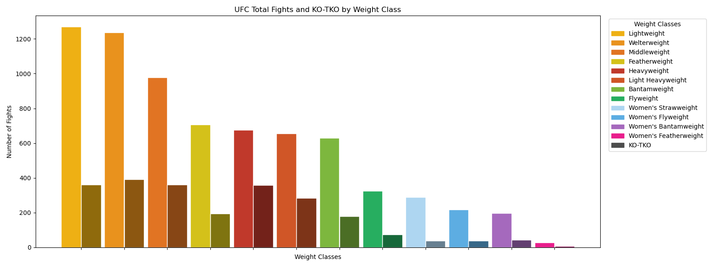
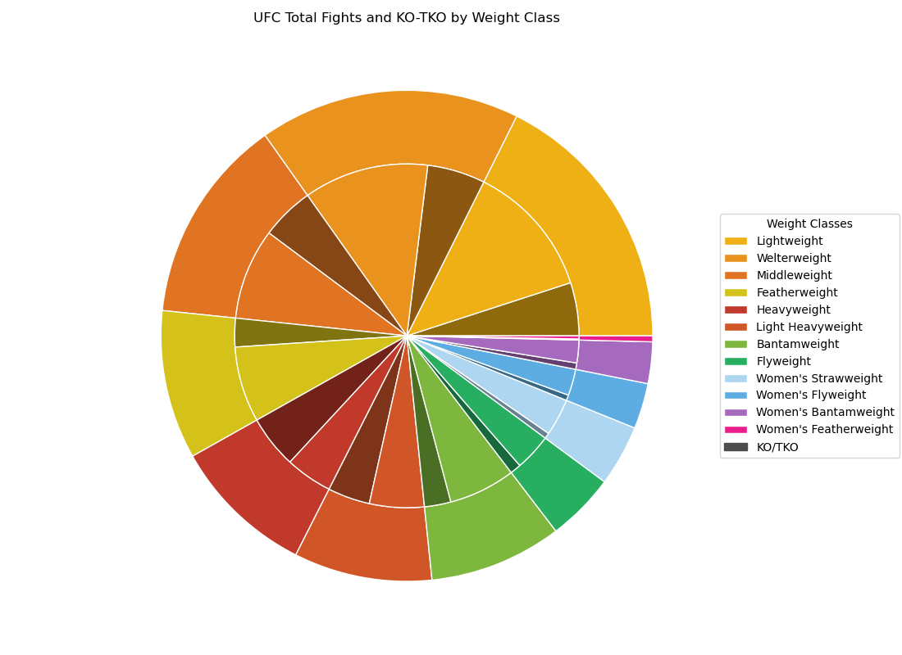

# UFC Fight Data Analysis
Analysis of UFC fight data from 1996 to 2024, exploring fight distribution and knockout
rates across all weight classes.

---

## Dataset
Data provided by [maksbasher on Kaggle](https://www.kaggle.com/datasets/maksbasher/ufc-complete-dataset-all-events-1996-2024)
under the [CC0 Public Domain licence](https://creativecommons.org/publicdomain/zero/1.0/).

---

## Features
- Fight distribution across all UFC weight classes
- KO/TKO rate comparison across weight classes
- Pie charts and grouped bar charts with consistent colour coding
- Automated data cleaning and weight class normalisation
- Unit tests for core data processing functions

---

## Sample Plots





---

## Project Structure
- `ufc_events_analysis.py` — main analysis and plotting code
- `TESTS/` — unit tests for data cleaning and processing functions
- `DATA/` — raw dataset
- `sample_plots/` — example output plots

---

## Requirements
- Python 3.x
- numpy
- pandas
- matplotlib

## Install dependencies
```bash
pip install numpy pandas matplotlib
```

## Run
```bash
python ufc_events_analysis.py
```

---

## License
This project is licensed under the MIT License.
Dataset originally published by maksbasher on Kaggle under the
[CC0 Public Domain licence](https://creativecommons.org/publicdomain/zero/1.0/).
