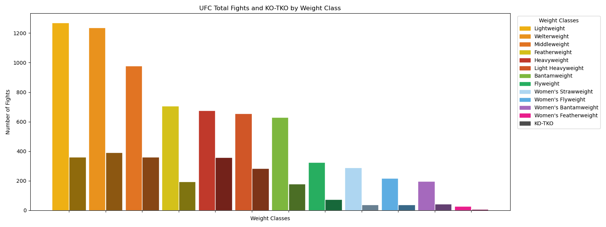
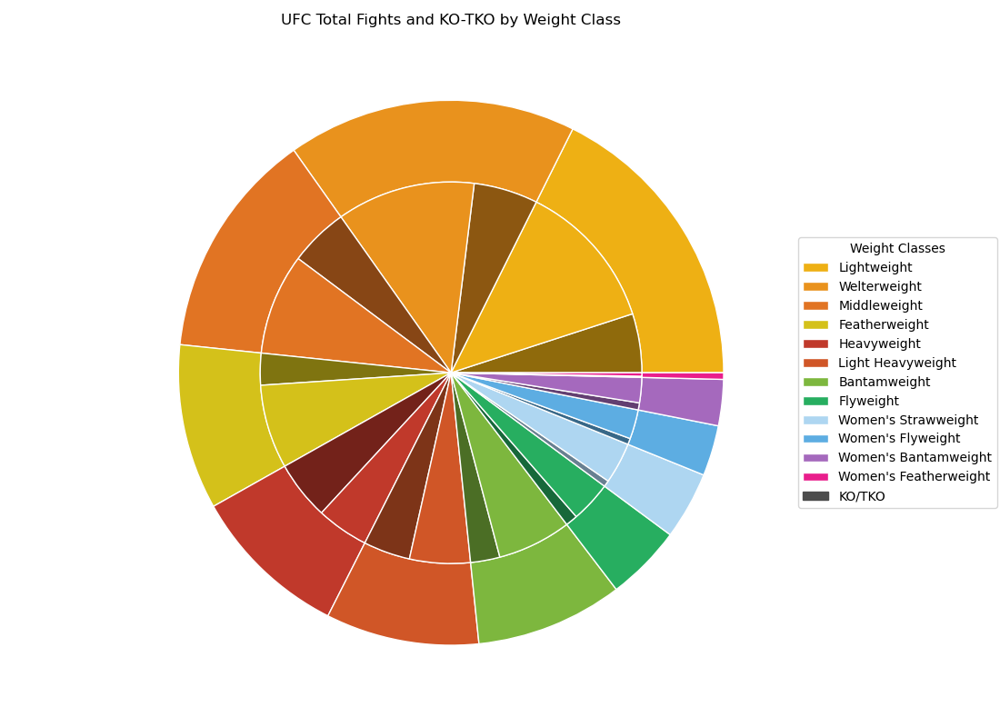
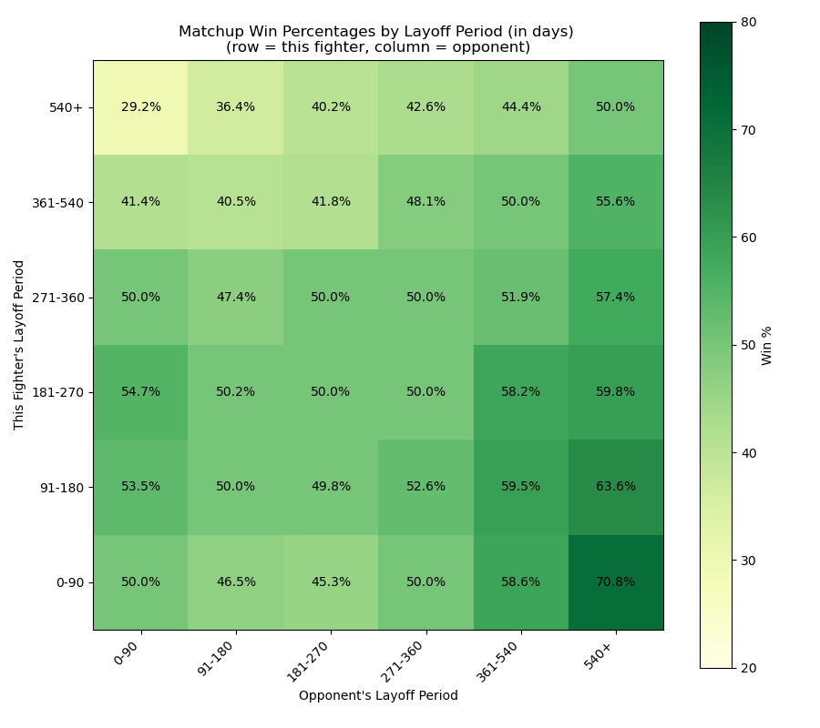

# UFC Fight Data Analysis
Analysis of UFC fight data from 1996 to 2024. We explore the following:
- Fight distribution and knockout rates across all weight classes.
- Win distribution by corner colour.
- Validity of ring rust (i.e. longer layoff times between fights results in lower win rates).
(The ring rust analysis was inspired by the same project presented on YouTube by the user 'Purple Belt Analytics' see https://www.youtube.com/watch?v=D3kaBoUZAuA)

---

## Dataset
Data provided by [maksbasher on Kaggle](https://www.kaggle.com/datasets/maksbasher/ufc-complete-dataset-all-events-1996-2024)
under the [CC0 Public Domain licence](https://creativecommons.org/publicdomain/zero/1.0/).

---

## Features
- Fight distribution across all UFC weight classes
- KO/TKO rate comparison across weight classes
- Win rate comparison by corner colour
- Analysis of layoff impact to win rate.
- Pie charts and grouped bar charts with consistent colour coding
- Automated data cleaning and weight class normalisation
- Unit tests for core data processing functions

---

## Sample Plots








---

## Project Structure
- `ufc_events_analysis.py` — main analysis and plotting code
- `Notes_on_data_sets.txt` — Some notes on the exact intricacies of the data sets, and small adjustments done to them.
- `TESTS/` — unit tests for data cleaning and processing functions
- `DATA/` — raw dataset
- `sample_plots/` — example output plots

---

## Requirements
- Python 3.x
- numpy
- pandas
- matplotlib

## Install dependencies
```bash
pip install numpy pandas matplotlib
```

## Run
```bash
python ufc_events_analysis.py
```

---

## License
This project is licensed under the MIT License.
Dataset originally published by maksbasher on Kaggle under the
[CC0 Public Domain licence](https://creativecommons.org/publicdomain/zero/1.0/).
